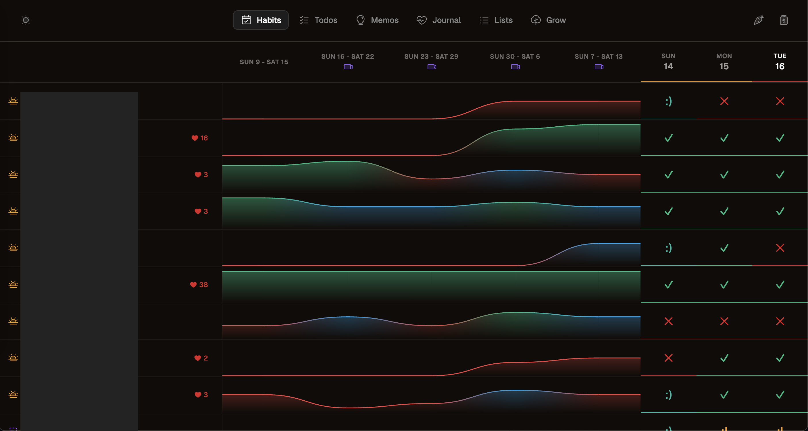

# 🌳 Start

Start aka Start Menu is my command center for habits, daily todos, notes, journals, lists, and goals. I use this as the "open" tab on my personal computer. It also makes it easy to access my calendar, my budgetting app, Linear, and Perplexity. I also integrated Loom, and then replaced it with Screenity, to record weekly vlogs. 

## Features

### 📊 **Habits**
Track your daily habits with convenient rollup metrics.



- **Sunday Reflection**: Record an end-of-week video reflection using the built-in **Loom SDK recorder**
- **Flexible categories**: morning, night, exercise, health, weekdays, etc with icon differentiation and quick filtering
- **Collapsible week views** See weekly progress rolled up over time
- **State tracking**: Customizable states: ✅ Done, ❌ Failed, 🙂 Failed with exception, or 🫤 Succeeded Poorly

### ✅ **Todos**
Daily task management separated by **Life** and **Work**. Inspired by [Tweek](https://tweek.so/).


- **Easy task punting** - move incomplete tasks to the next day
- **Status sorting** - unfinished tasks always appear first
- **Work life balance** - lol. Tasks are split into two columns, life and work. When `?mode=work` is added to the URL, only work tasks are shown/fetched.

### 💭 **Memos**
Integrated [Memos](https://github.com/usememos/memos) as an iFrame for quick thoughts and notes. Better than a notes app where everything gets lost. Memos has search, hashtags, date-filters, and more.


### 📔 **Journal**
Daily check-ins with thoughtful prompts worth asking every day.

### 📝 **Lists**
Organize ideas and groups of thoughts that belong together. Looks like Todoist Kanban view. **Perfect for**: Groceries, Furniture ideas, Movie watchlists.

### 🌱 **Grow**
Google Keep-style cards for ideas on what to do next. Mosaic tile layout with variable colors and tile sizes. 

### ☀️ **Daylight** (Bonus/Screensaver)


<!-- 


 -->

[Daylight by bakkenbaeck](https://daylight.today/app/) is a simple, beautiful sun position visualizer powered by `sunCalc`, a React library that returns the suns location based on your timezone, and I've been using their website for years. [Since it's open source](https://github.com/bakkenbaeck/daylight-web), I decided to fork it to add more color schemes, more icons, more sayings, and fixed lines to mark the 9-5 and bedtime. I also zoomed in a bit, which is really satisfying. It acts as a nice screensaver that you can leave on all day.

## Getting Started

### Prerequisites
- Node.js (v16+)
- pnpm
- CockroachDB (or any PostgreSQL-compatible database)

### Installation

1. **Clone the repository**
   ```bash
   git clone <your-repo-url>
   cd habits
   ```

2. **Install dependencies**
   ```bash
   cd server && npm install && cd ..
   cd client && pnpm install && cd ..
   ```

3. **Configure the database**
   
   Create a `.env` file in the `server/` directory:
   ```bash
   PORT=3000
   DATABASE_URL=<your-cockroachdb-connection-string>
   ```

4. **Start the app**
   ```bash
   ./go.sh
   ```

   This will:
   - Start the API server on `http://localhost:3000`
   - Start the client on `http://localhost:5173`
   - Open your browser automatically

## Project Structure

```
habits/
├── client/                  # React + TypeScript + Vite frontend
│   ├── src/
│   │   ├── api/             # API client functions
│   │   ├── components/      # UI components by feature
│   │   │   ├── habits/      # Habit tracking
│   │   │   ├── today/       # Todos
│   │   │   ├── journal/     # Diary/Journal
│   │   │   ├── lists/       # Kanban lists
│   │   │   ├── grow/        # Ideas cards
│   │   │   ├── memos/       # Memos iframe
│   │   │   ├── daylight/    # Screensaver
│   │   │   └── shared/      # Navigation, common components
│   │   ├── types.ts         # TypeScript interfaces
│   │   └── App.tsx          # Main app with routing
│   └── package.json
├── server/                  # Express.js API
│   ├── index.js             # Server setup & middleware
│   ├── db.js                # PostgreSQL connection pool
│   ├── routes/              # API route handlers
│   │   ├── habits.js
│   │   ├── tasks.js
│   │   ├── diary.js
│   │   ├── lists.js
│   │   ├── next.js
│   │   └── vlogs.js
│   └── package.json
├── assets/                  # Demo GIFs and images
├── go.sh                    # One-command startup script
└── README.md
```

## Tech Stack

- **Web Client**: React + TypeScript + Vite
- **API Server**: Node.js + Express
- **Database**: CockroachDB (PostgreSQL-compatible)
- **Styling**: CSS Modules with Phosphor Icons
- **Video**: Loom SDK

## Data Storage

All data is stored in **CockroachDB** using the following tables:

| Table | Purpose |
|-------|---------|
| `habits` | Habit definitions (name, schedule, order) |
| `entries` | Daily habit entries (date, state) |
| `tasks` | Todo items (text, date, category, state) |
| `questions` | Journal prompts |
| `diary_entries` | Journal answers |
| `lists` | List containers |
| `list_items` | Items within lists |
| `next_items` | Ideas/notes cards |
| `vlogs` | Weekly video reflections |

CockroachDB's free tier is very generous and should be more than enough for personal use.
They do require a CC but with price limiting, and $15 of free credits every month, this works very well for this project.
Thank you Venture Capitalist who is paying for me to improve myself. I will eat you.

## Development

### Running the app
```bash
./go.sh
```

### Server only
```bash
cd server && node index.js
```

### Client only
```bash
cd client && pnpm run dev
```

### Building for production
```bash
cd client && pnpm run build
```

### Work Mode
Access `?mode=work` in the URL for a privacy-focused mode that only shows work tasks.

Useful for separating personal data from work — only the Todos tab is visible, and it fetches only the "Work" column using dedicated work-only APIs. Daylight still works and displays time markers for 9am and 5pm.

## API Endpoints

> See [server/README.md](server/README.md) for the complete API reference.

### Habits
- `GET /habits` - Get all active habits
- `GET /habit-entries?from=&to=` - Get entries in date range
- `POST /habit-entry` - Create/update entry

### Tasks
- `GET /tasks` - Get all tasks
- `GET /tasks/week?start=&end=` - Get tasks for date range
- `POST /tasks` - Create task
- `PATCH /tasks/:id` - Update task
- `DELETE /tasks/:id` - Delete task
- `POST /tasks/batch/punt` - Punt multiple tasks to next day
- `POST /tasks/batch/fail` - Fail multiple tasks

### Diary
- `GET /questions` - Get all questions
- `POST /questions` - Create question
- `GET /diary` - Get all diary entries
- `POST /diary-entries` - Create/update entry
- `PATCH /diary-entries/:id` - Update entry
- `DELETE /diary-entries/:id` - Delete entry

### Lists
- `GET /lists` - Get all lists with items
- `POST /lists` - Create list
- `PATCH /lists/:id` - Update list
- `DELETE /lists/:id` - Delete list

### Next (Ideas)
- `GET /next` - Get all ideas
- `POST /next` - Create idea
- `PATCH /next/:id` - Update idea

### Vlogs
- `GET /vlogs/:weekStartDate` - Get vlog for week
- `POST /vlogs` - Create/update vlog

## Design

**Start** is built around a few core principles:

1. **Single source of truth** - One app for all your personal organization
2. **Minimal friction** - Quick to open, quick to use
3. **Visual clarity** - Clean design with meaningful colors and icons
4. **Daily focus** - Emphasizes today while tracking long-term progress

## Privacy

All data is stored in your own CockroachDB instance. Nothing is sent to external servers except what you explicitly configure (like Loom for video reflections).

## Acknowledgments

Tools:
- [Phosphor Icons](https://phosphoricons.com/) - For beautiful, consistent icons
- [Loom SDK](https://www.loom.com/sdk) - For seamless video recording

Open Source used:
- [Memos](https://github.com/usememos/memos) - For the embedded note-taking experience
- [Daylight](https://daylight.today/app/) - For the sun position screensaver inspiration

Inspiration:
- [Tweek](https://tweek.so/) - Todos
- [BeaverHabits](https://beaverhabits.com/) - Habit tracking
