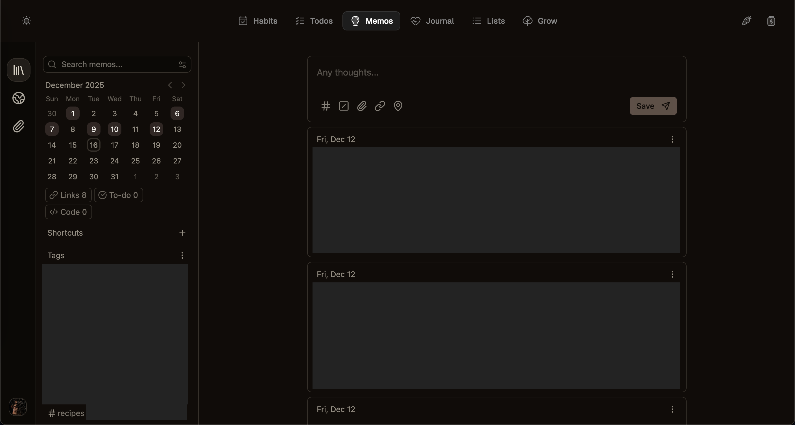

# ▶️ Start

Start Menu, aka Start, is my personal dashboard for Habits, Todos, Memos, Journals, Lists, and Goals. 

I serve this on my local network and access it across different devices. There's also a work mode with restricted data fetching to keep my personal data off of the corporate VPN. I remixed [Daylight](https://github.com/bakkenbaeck/daylight-web) as a screensaver. I resurrected [Nook](https://github.com/micaiah-buttars/nook) to play background music every hour from Animal Crossing. I also integrated [Cap](https://github.com/CapSoftware/Cap) to record weekly vlogs. 

This app exists to make it easy to iterate on *how* I organize myself. Ideally, building a bespoke UX and feature set will encourage consistency w.r.t reflection and personal growth. 

---

## Design

**Start** is built around a few core principles:

1. **Single source of truth** - One app for all your personal organization
2. **Minimal friction** - Quick to open, quick to use
3. **Visual clarity** - Clean design with meaningful colors and icons
4. **Daily focus** - Emphasizes today while tracking long-term progress

## Features

### 📊 **Habits**

<details>
  <summary>Track your daily habits with convenient rollup metrics.</summary>

- **Sunday Reflection**: Record an end-of-week video reflection using the built-in **Loom SDK recorder**
- **Flexible categories**: morning, night, exercise, health, weekdays, etc with icon differentiation and quick filtering
- **Collapsible week views** See weekly progress rolled up over time
- **State tracking**: Customizable states: ✅ Done, ❌ Failed, 🙂 Failed with exception, or 🫤 Succeeded Poorly
</details>


### ✅ **Todos**
<details>
  <summary>Daily task management separated by Life and Work. Inspired by https://tweek.so/ </summary>
   
- **Drag and drop** - easily move tasks between status accordions, or to the graveyard
- **Easy task punting** - move incomplete tasks to the next day
- **Days punted counter** - display how many days I've procrastinated lol
- **Task Graveyard** - persist tasks without being assigned to a date for later
- **Status sorting** - unfinished tasks always appear first
- **Work life balance** - lol. Tasks are split into two columns: life and work. When `?w` is added to the URL, only work tasks are shown/fetched.
</details>


### 💭 **Memos**
Integrated [Memos](https://github.com/usememos/memos) as an iFrame for quick thoughts and notes. Better than a notes app where everything gets lost. Memos has search, hashtags, date-filters, and more.



### 📔 **Journal**
Daily check-ins with thoughtful prompts worth asking every day.

### 📝 **Lists**
Organize ideas and groups of thoughts that belong together. Looks like Todoist Kanban view. **Perfect for**: Groceries, Furniture ideas, Movie watchlists.

### 🌱 **Grow**
Google Keep-style cards for ideas on what to do next. Mosaic tile layout with variable colors and tile sizes. 

### ☀️ **Daylight** (Bonus/Screensaver)


[Daylight by bakkenbaeck](https://daylight.today/app/) is a simple, beautiful sun position visualizer powered by `sunCalc`, a React library that returns the suns location based on your timezone, and I've been using their website for years. [Since it's open source](https://github.com/bakkenbaeck/daylight-web), I decided to fork it to add more color schemes, more icons, more sayings, and fixed lines to mark the 9-5 and bedtime. I also zoomed in a bit, which is really satisfying. It acts as a nice screensaver that you can leave on all day.

---

## Getting Started

### Prerequisites
- [Bun](https://bun.sh/) (v1.0+) - runtime and package manager
- CockroachDB (or any PostgreSQL-compatible database)

### Installation

1. **Clone the repository**
   ```bash
   git clone <your-repo-url>
   cd habits
   ```

2. **Install Bun** (if not already installed)
   ```bash
   curl -fsSL https://bun.sh/install | bash
   ```

3. **Install dependencies**
   ```bash
   bun install --cwd client
   bun install --cwd server
   ```

4. **Configure the database**
   
   Create a `.env` file in the `server/` directory:
   ```bash
   PORT=3000
   DATABASE_URL=<your-cockroachdb-connection-string>
   ```

   Setup a CockroachDB instance. Then run `server/db_utils/table_setup.sql` to create the necessary tables.

5. **Configure Cap URL** (Optional)

   Create a `.env` file in the `client/` directory:
   ```
   VITE_CAP_URL=your_cap_dashboard
   ```

6. **Start the app**
   ```bash
   ./go.sh
   ```

   This will:
   - Start the API server on `http://localhost:3000`
   - Start the client on `http://localhost:5173`
   - Open your browser automatically

## Documentation

| Section | Description |
|---------|-------------|
| 📖 [**Client Documentation**](client/README.md) | Frontend setup, project structure, components, and features |
| 🔧 [**Server Documentation**](server/README.md) | API reference, database schema, and backend details |

## Tech Stack

- **Web Client**: React + TypeScript + Vite
- **API Server**: Express + TypeScript (running on Bun)
- **Runtime/Package Manager**: Bun
- **Database**: CockroachDB (PostgreSQL-compatible)
- **Styling**: CSS Modules with Phosphor Icons

## Privacy

All data is stored in your own CockroachDB instance. Nothing is sent to external servers except what you explicitly configure (like Loom for video reflections).

## Acknowledgments

**Tools:**
- [Phosphor Icons](https://phosphoricons.com/) - For beautiful, consistent icons
- [Loom SDK](https://www.loom.com/sdk) - For seamless video recording

**Open Source:**
- [Memos](https://github.com/usememos/memos) - For the embedded note-taking experience
- [Daylight](https://daylight.today/app/) - For the sun position screensaver inspiration
- [Cap](https://cap.so/docs/self-hosting) - For the video recording experience

**Inspiration:**
- [Tweek](https://tweek.so/) - Todos
- [BeaverHabits](https://beaverhabits.com/) - Habit tracking
